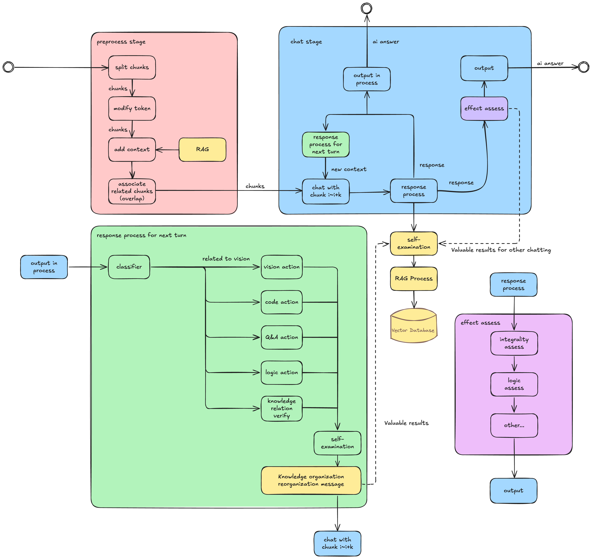
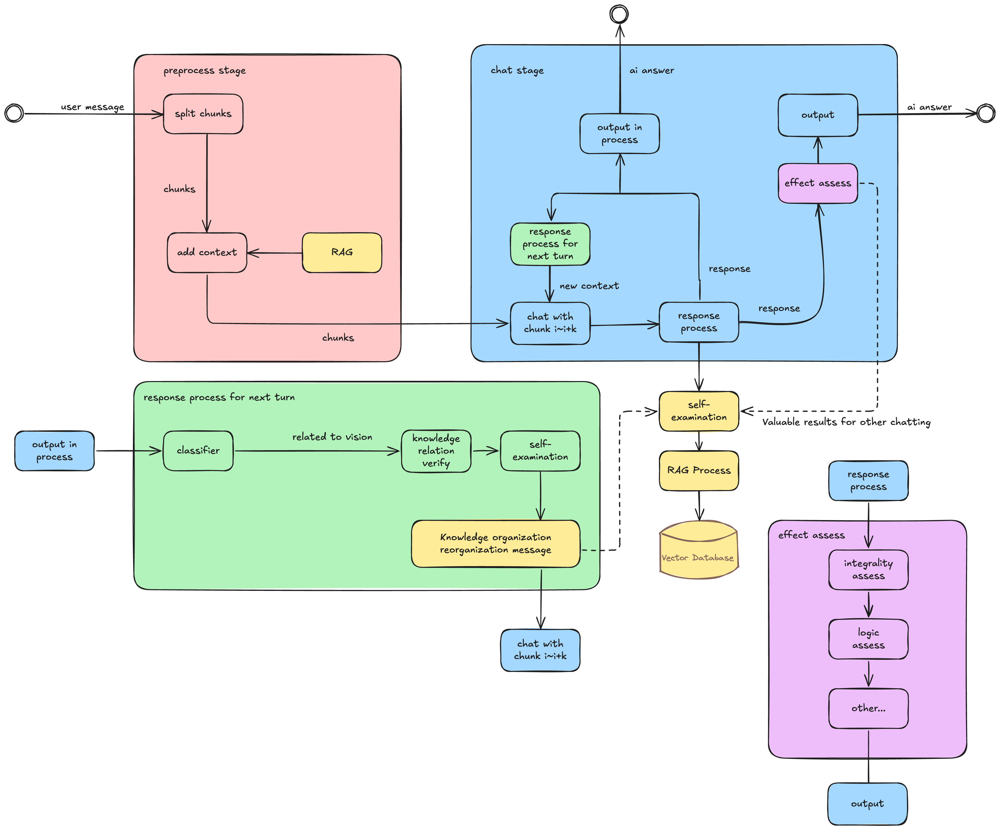

# Mortis develop roadmaps
## Background
Mortis is a framework to manage applications' llm chat system.We provide so-called "Chat Pipeline" for developers to iterate knowledge.
 fig. all concept of mortis
## Feature
We find some text will be forgotten when we input long text to llm, and it's hard to use prompt to instruct llm "you must process all the text".
The basic way to improve is to split text and chat more turns.
But unfortunately apps can't learn something from so many chat turns if we don't collect and process these messages actively.
So It is useful to develop a sdk to solve problems.\
fig. early concept of mortis

### Recurrent Chat pipeline
The first idea is to manage chat turns.We introduce some methods during chat process to assess and improve chat qualification.